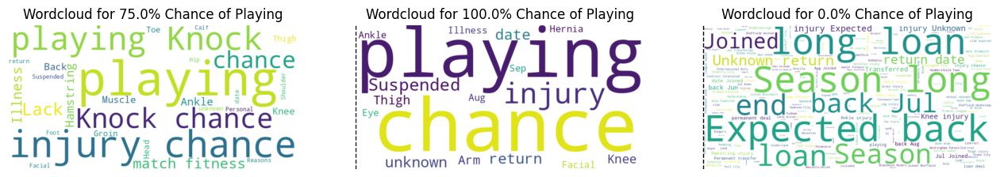
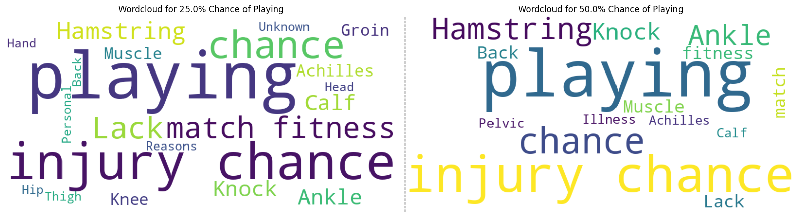
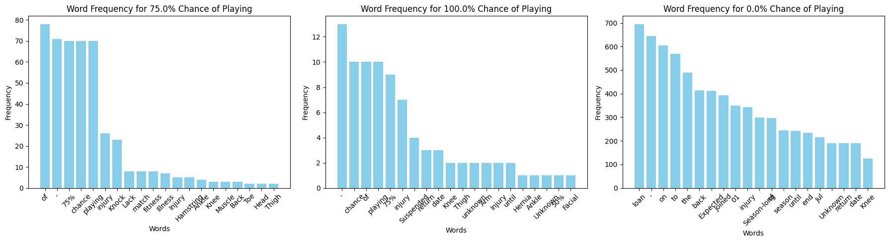
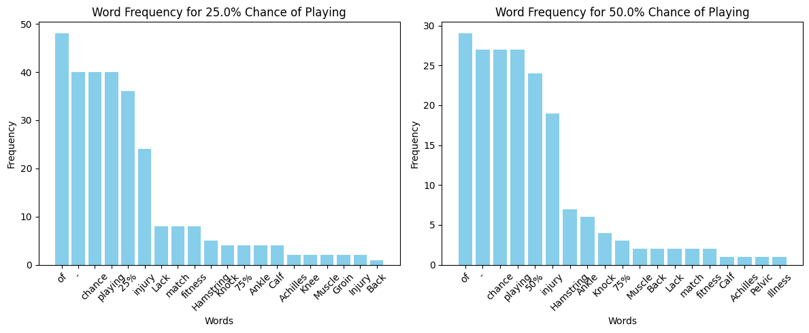
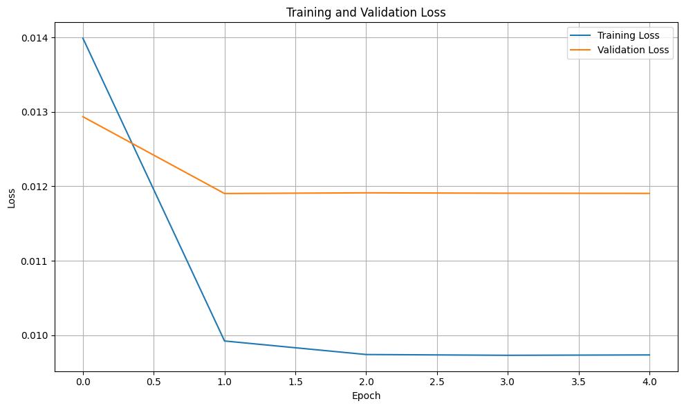
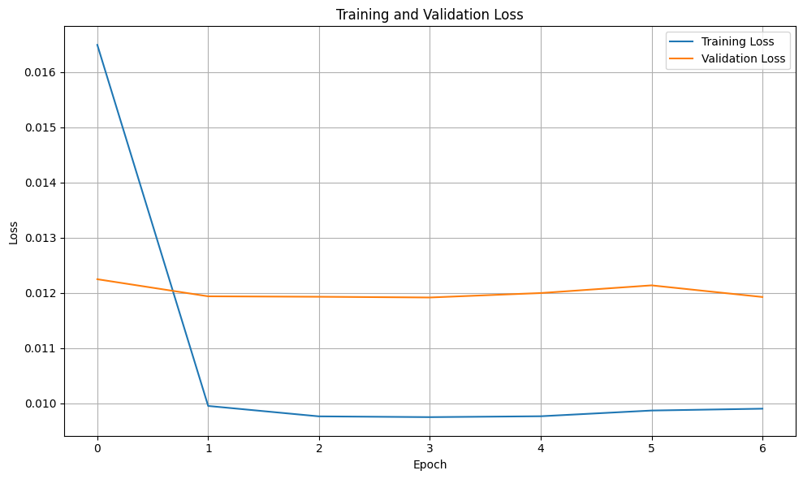

## Final Project NLP

## Introduction
This project focuses on predicting the likelihood of player availability for football matches based on text news reports. We use Natural Language Processing (NLP) to analyze the news headlines and apply both RNN (LSTM) and CNN models to obtain the probability of the available player. Both models are designed to extract relevant features from text and use them to predict player availability.

## Problem Statement
In Fantasy Premier League (FPL), making informed decisions is key to success. While player statistics are valuable, real-time news on injuries, transfers, and team updates can significantly impact player performance. This project aims to analyze relevant news to provide FPL managers with actionable insights, helping them make better transfers, captain choices, and squad selection decisions.

## Dataset ##
In this project, I used historical player statistics from the 2016-2017 to 2023-2024 seasons, which I obtained from Vaastav’s GitHub repository ([Vaastav's FPL Data Repository](https://github.com/vaastav/Fantasy-Premier-League)). The dataset contains various player attributes, such as goals scored, assists, and clean sheets. My main focus is on analyzing how news articles and the `chance_of_playing_this_round` variable can offer insights into a player's likelihood of starting in an upcoming match.

## EDA ##

For the exploratory data analysis (EDA), I visualized the distribution of player-related news based on their reported "chance of playing this round." First, I generated word clouds for different percentages of playing chances to highlight the most common words associated with each probability. This provided a quick and intuitive overview of the recurring words in the dataset.

To gain deeper insights, I followed up with histograms that display the frequency of the top 20 most common words within each category. These histograms helped identify key terms that are heavily associated with specific playing probabilities, offering a first insight of the text data.

## Dataprocess

Once I got a first glance at the data, I processed the textual data in the following way:

#### Tokenization and Vocabulary Building

1. **Preprocessing and Tokenization:**
   - I tokenized the news articles using the Natural Language Toolkit (NLTK). The tokenization process involved splitting each news article into words and filtering out numeric tokens (like scores or percentages).

2. **Creating the Vocabulary:**
   - I built a vocabulary from the training data, mapping each unique word to an integer index. This step is essential for converting the text into a format suitable for deep learning models. The vocabulary excludes numeric tokens and includes a special `<unk>` token to handle any words not seen during training.

3. **Embedding Initialization:**
   - To initialize the embedding layer of my models, I used pre-trained word embeddings. These embeddings provide dense vector representations of words, capturing their semantic meaning. I loaded these embeddings from a file and mapped each word in the vocabulary to its corresponding vector.

#### Data Preparation

After tokenizing the text data and converting it into sequences of integer indices, I padded these sequences to ensure they all have the same length. This padding helps in maintaining consistency when training the models.

I then split the dataset into training, validation, and test sets using an 80/10/10 split. For each set, I created a dataset object that handles data loading and batching during model training and evaluation.

By transforming the news data into tokenized sequences and using embeddings, I aim to extract useful information that can indicate whether players are likely to start in upcoming matches. This approach is designed to help FPL managers make more informed decisions.

## Model Architectures
### LSTM-RNN Model
The LSTM-RNN model is designed to capture the temporal dependencies in text data from news articles that impact FPL player performance and decision-making. It helps understand how sequential context in the text (like match updates or injury reports) can influence FPL strategies.

-Input Layer: Tokenized and preprocessed text sequences representing news articles or reports are input into the model.

-Embedding Layer: Converts each word into dense vector representations of size 100 to capture semantic meaning.

-RNN Layers: The model includes two stacked RNN layers with 128 hidden units each, which process the input sequentially. The recurrent layers capture temporal relationships between words in the news articles.

-Fully Connected (Dense) Layer: The output from the RNN layers is passed through a fully connected layer with a linear activation function.

### CNN Model
The CNN model is utilized to capture key phrases or patterns in news articles that are important for making FPL decisions. It is particularly useful for extracting non-sequential, spatial patterns in the text, such as keywords (e.g., “injury”, “suspension”) that may indicate significant changes in player status.

-Input Layer: Preprocessed news article text, converted into sequences of word embeddings, serves as the input.

- The model contains multiple convolutional layers, each with the same filter size (filter_sizes==3). The convolution is applied with:
1)Input Channels: 1 (text is treated as a 1-channel image).
2) Output Channels: num_filters (number of feature maps).
3) Kernel Size: (filter_size, embed_dim) where filter_size is the same value for each convolutional layer. 
4) After convolution, the outputs are passed through a ReLU activation function.
-Max-Pooling Layer: After each convolutional layer, max pooling is applied over the dimension (sequence length). This reduces the dimensionality and selects the most important features (the most prominent feature per filter for the sequence).
- Concatenation: The outputs from each convolutional layer are pooled and then concatenated along the feature dimension to combine the features from all filter sizes into a single vector.
-Fully Connected (Dense) Layer:The concatenated vector is passed through a fully connected layer (self.fc), which maps the extracted features to the output dimension (output_dim), typically corresponding to the number of classes in classification or a single value in regression.

### Experiments

#### Model Training

Two models were trained to evaluate their performance on predicting player statistics from historical data and news: an RNN model and a CNN-based model. The training procedures are detailed below:

**1. RNN Model Training**

- **Architecture:** LSTM-based RNN with bidirectional layers.
- **Maximum Epochs:** 200
- **Batch Size:** 32
- **Early Stopping:** Patience of 3 epochs, monitoring validation loss to prevent overfitting.
- **Model Checkpointing:** Saves the best model based on validation loss.

The training was conducted using the PyTorch Lightning `Trainer`, with logs recorded using `CSVLogger`. The final model was saved and evaluated on the test set.

**2. CNN Model Training**

- **Architecture:** CNN with multiple filter sizes (3,3,3) and 4 filters.
- **Maximum Epochs:** 200
- **Batch Size:** 32
- **Early Stopping:** Patience of 3 epochs, monitoring validation loss.
- **Model Checkpointing:** Saves the best model based on validation loss.

The training was also managed using PyTorch Lightning. After training, the model was re-instantiated from the checkpoint and evaluated on the test set. The test results were logged and visualized.

#### Results

**RNN Loss Curves**

**RNN Test Set Results**
- **Test Mean Squared Error (MSE):** \(0.00012 \)
- **Test Mean Absolute Error (MAE):** \( 0.01122 \)

**CNN Loss Curvas**

**CNN Test Set Results**
- **Test Mean Squared Error (MSE):** \( 0.00007 \)
- **Test Mean Absolute Error (MAE):** \( 0.00878 \)

**Model Checkpoints:** The best-performing models based on validation loss were saved and used for final evaluation. For the CNN model, the best model was saved at `/content/checkpoints/best_model-epoch=01-val_loss=0.01-v4.ckpt`.

Overall, both models demonstrated strong performance in predicting player statistics, with the CNN model showing lower error metrics compared to the RNN model. The results suggest that both approaches are viable for analyzing player performance data and making informed FPL decisions.

### Predictions

This section showcases example predictions from both the RNN and CNN models. Each prediction demonstrates how the models interpret various news phrases to estimate the likelihood of a player’s participation in the upcoming match.

#### LSTM-RNN Model Predictions

The following examples show predictions from the RNN model. The predicted probabilities are computed based on the given phrases.

| Phrase                                                      | Predicted Probability |
|-------------------------------------------------------------|------------------------|
| "Chelsea agree transfer, player on loan to Reading."       | 0.9402                 |
| "Manchester City completed a season-long loan deal with Crewe Alexandra." | 0.8708                 |
| "Ankle injury operation is needed"                         | 0.0660                |
| "Liverpool announce new deal for Salah"                    | 0.1602                 |

#### CNN Model Predictions

The following examples show predictions from the CNN model. Similar to the RNN model, these probabilities are derived from the given phrases.

| Phrase                                                      | Predicted Probability |
|-------------------------------------------------------------|------------------------|
| "Chelsea agree transfer, player on loan to Reading." | 1.0000                 |
| "Manchester City completed a season-long loan deal with Crewe Alexandra."      | 1.0000                 |
| "Ankle injury operation is needed"| 0.0003                |
| "Liverpool announce new deal for Salah"                         | 1.0000                 |

The predictions indicate the model's assessment of the likelihood that the mentioned player will participate in the next match based on the provided news.

### Analysis
The prediction results from both the RNN and CNN models show that both models tend to predict very low probabilities for most phrases. For example, news about player transfers and injuries generally received a probability of 0.0000, indicating that both models interpret these as significant indicators of player participation.

### Conclusions

In summary, the RNN and CNN models both showed strong performance in predicting player statistics from news data, with the CNN model achieving lower error metrics compared to the LSTM model. The use of pretrained embeddings played a crucial role in improving model performance by enhancing their ability to understand and process text data. Both models would benefit from additional fine-tuning and a more diverse dataset to further improve prediction accuracy. Overall, these findings suggest that both RNN-LSTM and CNN models are valuable tools for analyzing player performance data and making informed FPL decisions, with each model offering advantages that could be applied on future analysis. 

### References

- V. Anand, ''Fantasy-Premier-League,'' github.com. Available: \url{https://github.com/vaastav/Fantasy-Premier-League}. 
- Mahadevaswamy, U. B., & Swathi, P. (2022). Sentiment analysis using bidirectional LSTM network. Procedia Computer Science, 218, 2866-2872. https://doi.org/10.1016/j.procs.2022.12.400
  
- Ramdas, Delano. (2022). Using Convolution Neural Networks to Predict the Performance of Footballers in the Fantasy Premier League. 10.13140/RG.2.2.10010.72645/2. 

